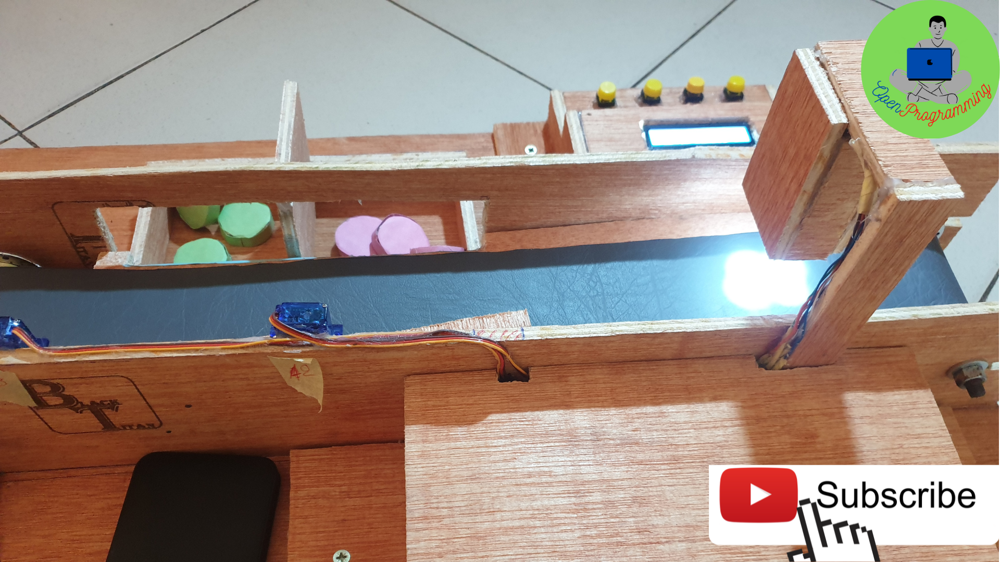
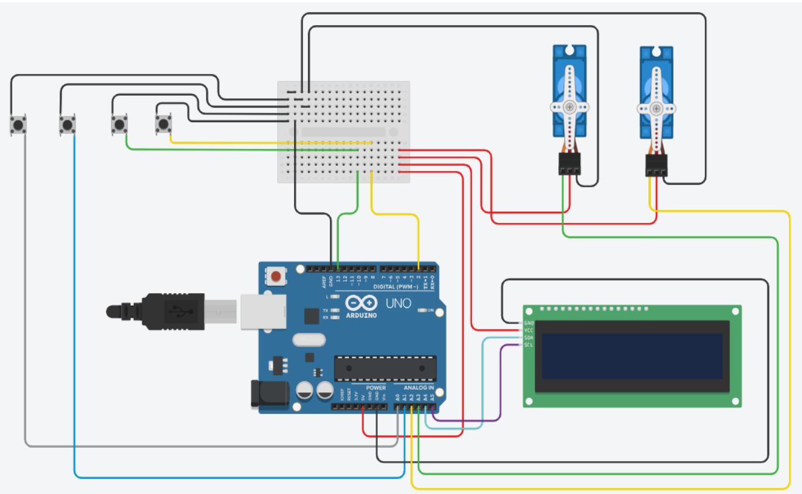
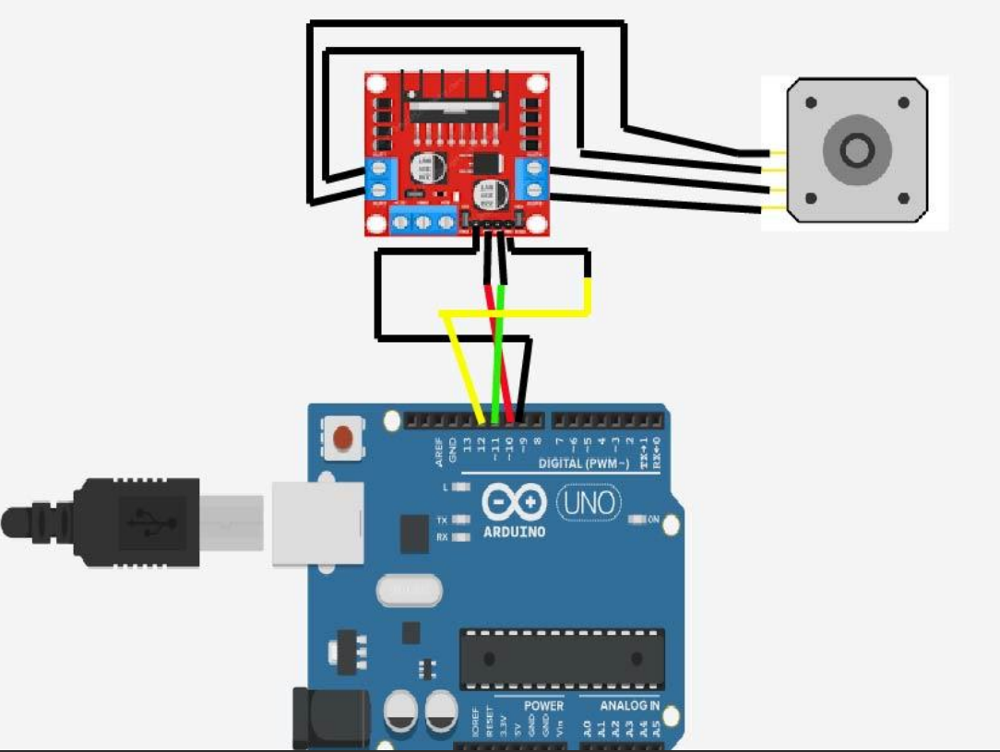
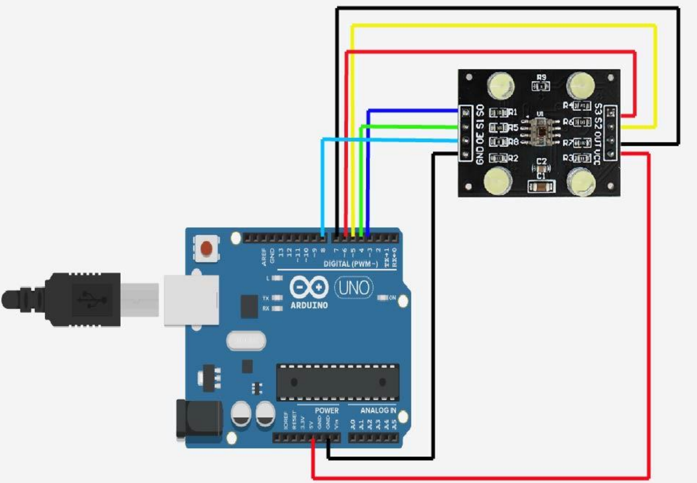
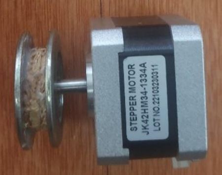
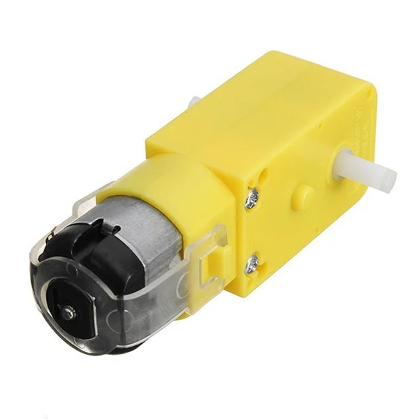

# Projet Arduino : Poste de Tri Automatique par couleur

- Email : openprogramming23@gmail.com
- Date : 30/10/2023 
- Auteur : Exaucé KIMBEMBE

## Description

Ce projet Arduino propose un système de tri et de rangement automatique des pièces en fonction de leur couleur. L'utilisateur peut choisir entre deux modes de fonctionnement : manuel et automatique.

### Fonctionnalités

1. **Mode Manuel :** L'utilisateur peut trier les pièces manuellement en appuyant sur les boutons poussoirs correspondant aux différentes couleurs des pièces. Cela offre une flexibilité totale à l'utilisateur pour un tri personnalisé.

2. **Mode Automatique :** Le tri automatique est activé en sélectionnant les couleurs désirées dans le menu de configuration. Une fois le moteur éteint, l'utilisateur peut choisir les couleurs souhaitées, puis relancer le moteur pour que le système effectue le tri automatique.

3. **Menu de Configuration :** Le menu de configuration permet à l'utilisateur de définir les couleurs de tri souhaitées. Assurez-vous d'éteindre le moteur avant de configurer le menu.

### Instructions d'Utilisation

1. Connectez le matériel conformément au schéma de câblage fourni.
2. Téléversez le code sur votre carte Arduino.
3. Alimentez le système.
4. Choisissez le mode de fonctionnement (manuel ou automatique) en utilisant le menu de configuration.
5. Pour le mode manuel, appuyez sur les boutons poussoirs correspondant aux couleurs des pièces.
6. Pour le mode automatique, éteignez le moteur, configurez le menu, puis rallumez le moteur.

### Schéma de Câblage

Moteur utiliser dans la version 2 du code

